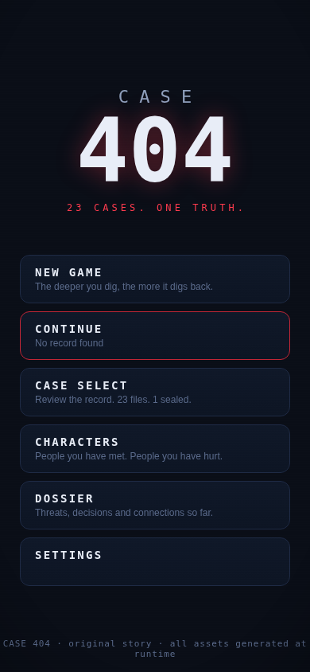
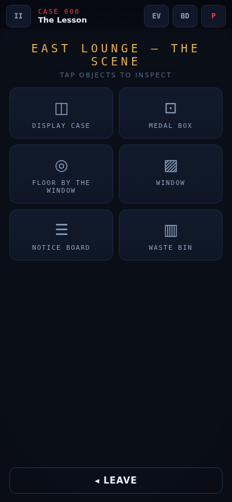
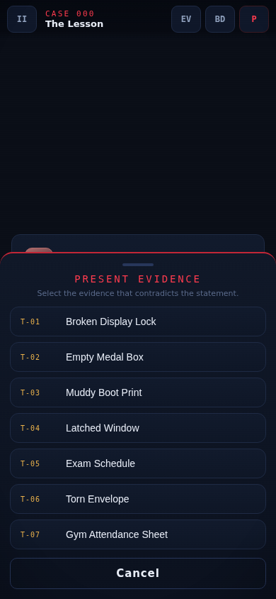
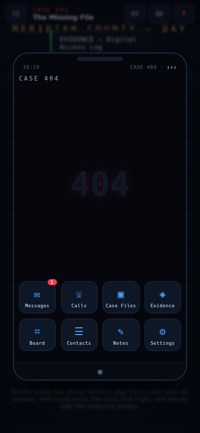
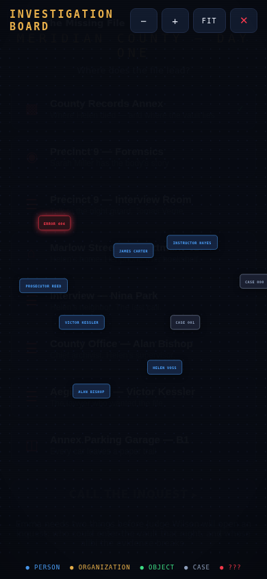

# CASE 404

> **23 CASES. ONE TRUTH.**
> A story-driven investigation & courtroom game for Android.
> *The deeper you dig, the more it digs back.*

<p align="center">
  
  
  
  
  
</p>

---

## What is CASE 404?

You are **James Carter** — a newly licensed Special Investigator in Meridian County with the rare authority to both investigate crimes *and* bring accusations before the court. You are assigned a chain of **23 interconnected criminal cases**. At first they look unrelated. Then the same phone number surfaces in two different years. Then a watch engraved **R.C.** appears in a dead man's safe. Then the files start disappearing — and every erased record leaves the same signature behind:

```
ARCHIVE SYNC ERROR 404
```

Something called **404** has been deleting this county's truth for twenty years. It knows your name. It hired you.

**All characters, cases, dialogue, locations and systems are original.** The game takes broad inspiration from the courtroom-drama and detective genres, but every story element is its own.

## Features

- **CASE 000 — The Lesson**: a full interactive tutorial that teaches investigation by playing, not reading.
- **CASE 001 — The Missing File**: a complete murder case — 4 locations, 5+ interrogations, 11 evidence items, hidden & misleading clues, a 3-branch inquest and a full courtroom battle with press/present cross-examinations.
- **CASE 002–023**: complete data-driven framework + master story plan ready to be filled in (see *Adding new cases*).
- **Branching dialogue** with evidence-gated options — confront NPCs with the proof they don't know you have.
- **Contradiction system** — compare testimony against phone records, timestamps, CCTV logs and documents.
- **NPC relationships & memory** — trust, fear, loyalty and suspicion persist across cases; NPCs remember how you treated them, many cases later.
- **Investigation board** — a draggable connection graph of people, organizations, evidence and the mystery node you can't name yet.
- **In-game phone** — messages (with Reply / Trace / Save / Delete consequences), calls, case files, contacts, notes, evidence and board shortcuts.
- **Threat system** — 7 escalating levels, from anonymous messages to direct attacks, with real gameplay effects.
- **Player choices with consequences** — wrong accusations, lost files, and betrayed allies change later cases.
- **Multiple endings (A–E)** — computed from the entire decision record.
- **Save system** — 3 slots + autosave + continue; survives app restarts.
- **100% procedural audio** — every sound and music loop is generated at runtime (Web Audio). No copyrighted assets, tiny APK.
- **Offline-first, lightweight** — no 3D, no frameworks, runs on any mid-range Android phone.

## Gameplay systems

| System | Where |
|---|---|
| Phase runner (narrative, location, hub, dialogue, contradiction, decision, courtroom, action, phone, epilogue) | `src/engine/engine.js` |
| Evidence archive + "present evidence" sheet | `src/systems/evidence.js` |
| Branching dialogue + confrontations | `src/systems/dialogue.js` |
| Courtroom (testimony → PRESS / PRESENT → contradiction breaks) | `src/systems/courtroom.js` |
| NPC relationships & memory | `src/engine/state.js` |
| Investigation board (SVG graph) | `src/systems/board.js` |
| In-game phone | `src/systems/phone.js` |
| Threat ladder (levels 0–7) | `src/systems/threat.js` |
| Endings architecture (A–E) | `src/systems/endings.js` |
| Saves (3 slots + autosave, localStorage) | `src/engine/save.js` |
| Procedural audio engine | `src/engine/audio.js` |

## Technology

- **HTML + CSS + vanilla JavaScript (ES modules)** — no framework, no build step for the game itself.
- **Data-driven cases** — every case is a JSON file under `data/cases/`.
- **[Capacitor 6](https://capacitorjs.com)** — wraps the web game into a native Android WebView shell.
- **Storage** — `localStorage` for saves and settings (offline).
- **GitHub Actions** — builds the debug APK on every push to `main`.

## Run locally

```bash
git clone https://github.com/arsam92/CASE-404.git
cd CASE-404
npm install
npx serve .          # or: python3 -m http.server 5173
# open http://localhost:5173 in a browser (use mobile viewport for the intended feel)
```

> The game is served as plain static files — any static file server works.

## Build the Android APK

See **[docs/BUILD_APK.md](docs/BUILD_APK.md)** for the full guide. Short version:

```bash
npm install
npm run apk:debug
# → android/app/build/outputs/apk/debug/app-debug.apk
```

Or open `android/` in **Android Studio** and press Run. Every push to `main` also produces an APK via the **Actions** tab.

## Project structure

```text
CASE-404/
├── android/                  # Capacitor Android project (APK)
├── src/
│   ├── engine/               # state, saves, phase runner, audio, data loader
│   ├── systems/              # evidence, dialogue, courtroom, phone, board,
│   │                         # threats, endings
│   ├── ui/                   # screens, locations, HUD, styles
│   └── main.js               # entry point
├── data/
│   ├── cases/                # case000.json … case023.json (data-driven)
│   ├── characters.json       # cast + hidden secrets
│   ├── evidence.json         # cross-case evidence registry
│   ├── story-plan.json       # master story graph (SPOILERS)
│   └── manifest.json         # case index
├── docs/
│   ├── STORY_PLAN.md         # complete plan for all 23 cases (SPOILERS)
│   ├── ADDING_CASES.md       # how to write CASE 024+
│   ├── ARCHITECTURE.md       # engine & data flow
│   ├── BUILD_APK.md          # Android build guide
│   └── screenshots/
├── scripts/                  # build-web, icon generator, smoke test, stub generator
├── assets/                   # generated icons
├── public/                   # PWA manifest + icons
├── .github/workflows/        # APK CI
├── capacitor.config.json
└── package.json
```

## Adding new cases

Cases are JSON. Copy `data/cases/case002.json` (a prepared hook stub), set `status: "playable"` in `data/manifest.json`, and write phases:

```json
{ "id": "p_intro", "type": "narrative", "lines": [ { "sp": "sarah", "t": "You're late." } ], "next": "p_hub" }
```

Phase types: `narrative`, `hub`, `location`, `dialogue`, `present`, `decision`, `courtroom`, `action`, `phone`, `epilogue`. Conditions (`req`) and effects (`ev:`, `flag:`, `rel:`, `threat:`, `msg:`, `board:` …) are documented in **[docs/ADDING_CASES.md](docs/ADDING_CASES.md)**. The engine needs **zero code changes** to add CASE 002–023 or CASE 024.

## Testing

```bash
python3 scripts/smoke_test.py     # full Playwright click-through of CASE 000 + CASE 001 systems
```

## Credits & licenses

- **Game design, story, code, art direction, audio synthesis** — original work for the CASE 404 project (MIT licensed, see [LICENSE](LICENSE)).
- **Icons & splash** — generated by `scripts/gen_icon.py` (PIL), original.
- **Audio** — 100% procedural (Web Audio API), original, no third-party samples.
- **Third-party packages** — Capacitor (MIT), used under its own license. See [docs/THIRD_PARTY_ASSETS.md](docs/THIRD_PARTY_ASSETS.md).

---

*“The deeper I investigate, the more dangerous this becomes.”*
